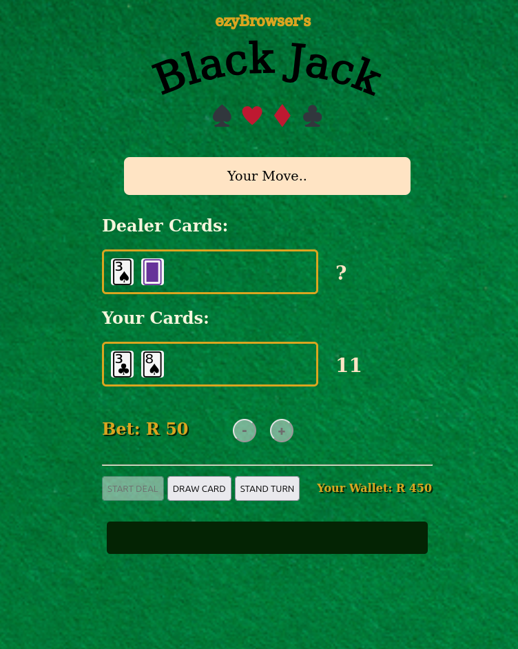
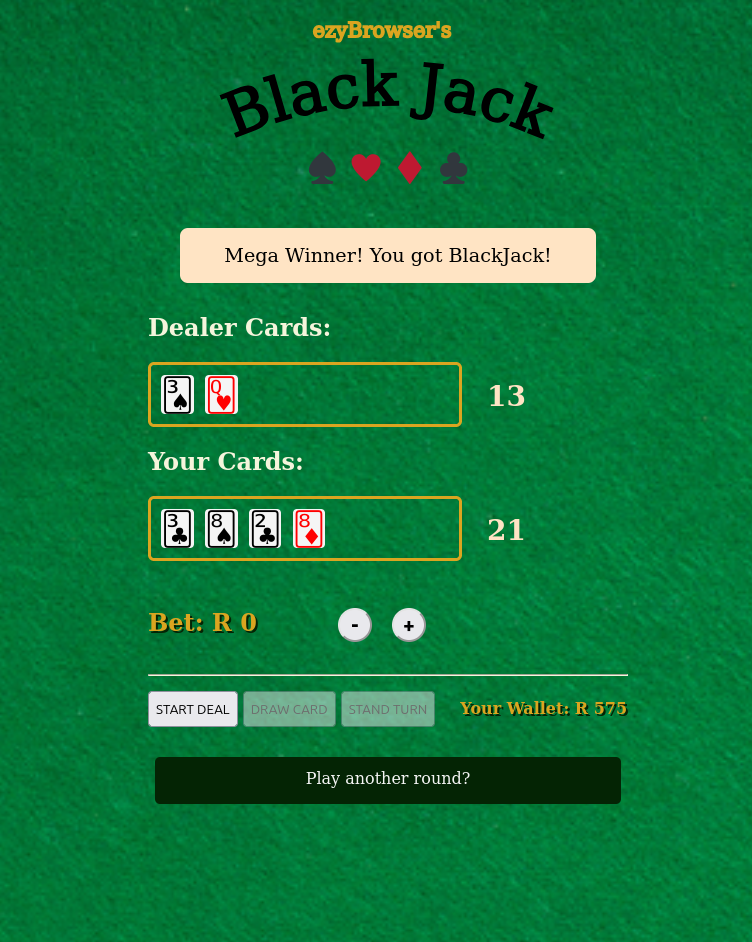
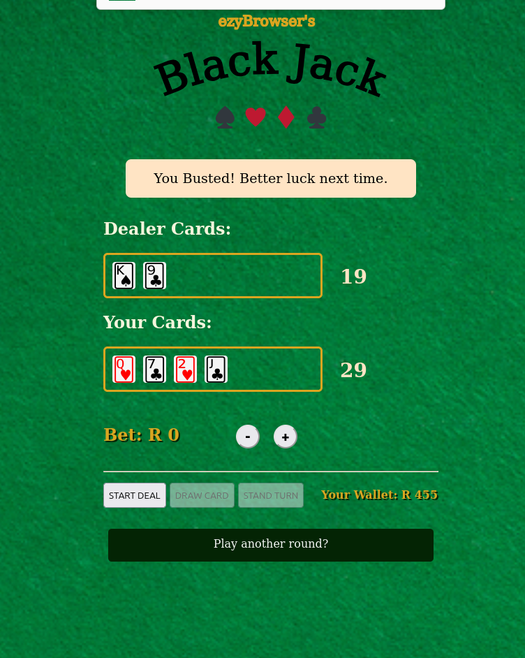
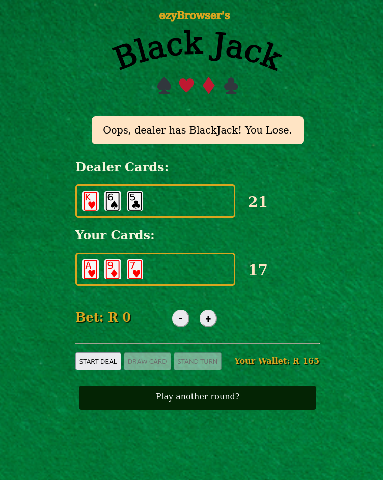

# Black Jack Game
A simple browser-based implementation of the game of Black Jack.

## Features
- Emulates an actual game through the use of card objects (not just a random number generator).
- Player starts with some cash, and may wager this to increase their total "wallet".
- Game can be played without any betting.

## Notes
Built as a bootcamp project using only HTML5, vanilla JS and vanilla CSS. Built in 2 days.

## Examples

#### Player Turn

#### Player Black Jack Winner

#### Player Bust

#### Dealer Wins

